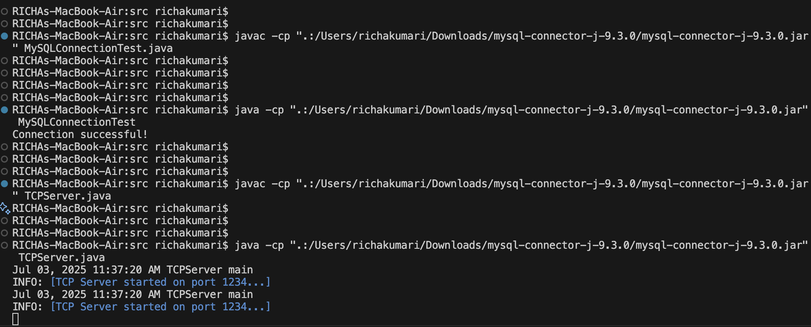
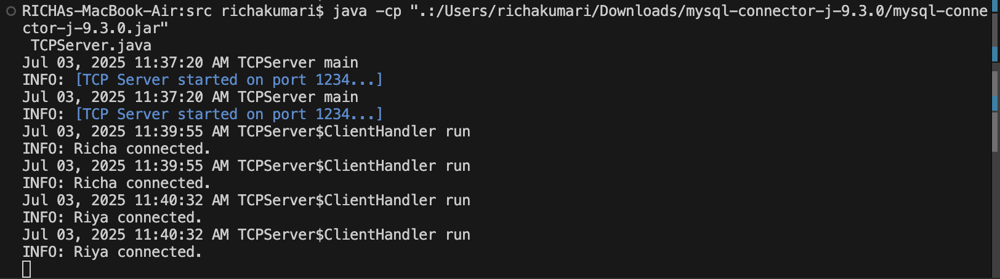
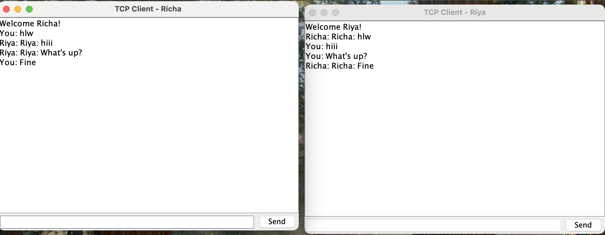
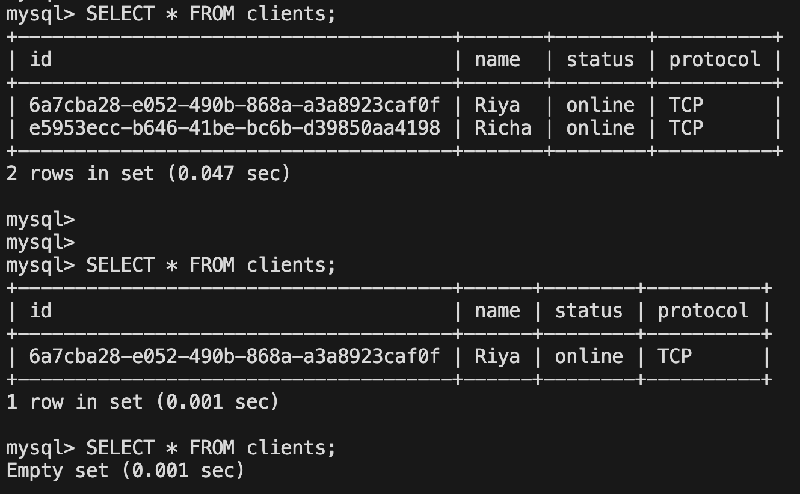
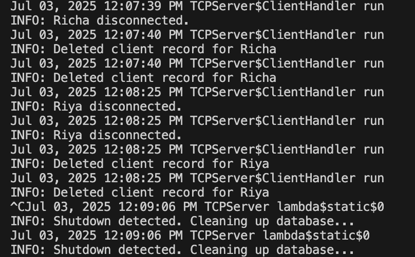
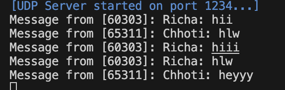
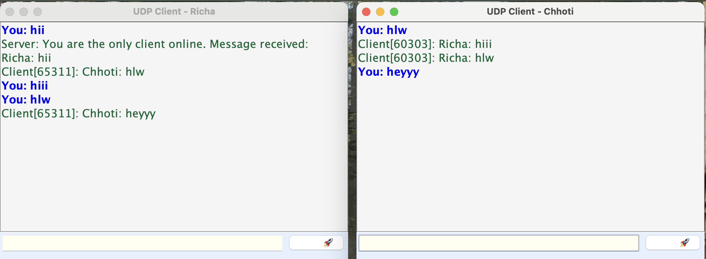

### TCP/UDP CHAT APPLICATION

## Description

This project is a simple client-server chat application that supports both TCP and UDP protocols. It allows multiple clients to connect and exchange messages in real-time.

## Features

- Supports both TCP and UDP communication
- Multiple clients can join the chat
- Real-time message broadcasting
- Simple GUI chat window for enhanced user experience
- Java and Swing 

### Application demo
    ### TCPServer
    $ java -cp ".:/path/mysql-connector-j-9.3.0/mysql-connector-j-9.3.0.jar" TCPServer.java 

    ###TCPClient
    $ java /path/TCPClientGUI.java

    ### UDPServer
    $ java /path/UDPServer.java

    ### UDPClient
    $ java /path/UDPClientGUI.java

